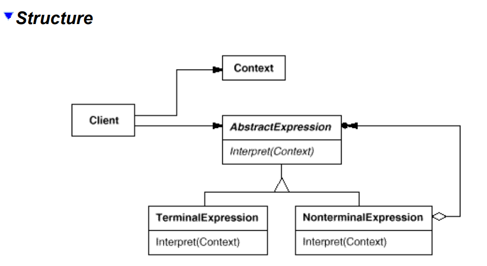

# Interpreter
## Intent
Given a language, define a represention for its grammar along with an interpreter that uses the representation to interpret sentences in the language.
## Applicability
Use the Interpreter pattern when there is a language to interpret, and you can represent statements in the language as abstract syntax trees. The Interpreter pattern works best when
- the grammar is simple. For complex grammars, the class hierarchy for the grammar becomes large and unmanageable. Tools such as parser generators are a better alternative in such cases. They can interpret expressions without building abstract syntax trees, which can save space and possibly time.
- efficiency is not a critical concern. The most efficient interpreters are usually not implemented by interpreting parse trees directly but by first translating them into another form. 
For example, regular expressions are often transformed into state machines. But even then, the translator can be implemented by the Interpreter pattern, so the pattern is still applicable. 
## Structure

## Participants
• **AbstractExpression** (RegularExpression)
- declares an abstract Interpret operation that is common to all nodes in the abstract syntax tree.

• **TerminalExpression** (LiteralExpression)
- implements an Interpret operation associated with terminal symbols in the grammar.
- an instance is required for every terminal symbol in a sentence.

• **NonterminalExpression** (AlternationExpression, RepetitionExpression, SequenceExpressions)
- one such class is required for every rule `R ::= R1R2...Rn` in the grammar.
- maintains instance variables of type AbstractExpression for each of the symbols R1 through Rn.
- implements an Interpret operation for nonterminal symbols in the grammar. Interpret typically calls itself recursively on the variables representing R1 through Rn.

• **Context**
- contains information that's global to the interpreter.

• **Client**
- builds (or is given) an abstract syntax tree representing a particular sentence in the language that the grammar defines. The abstract syntax tree is assembled from instances of the NonterminalExpression and TerminalExpression classes.
- invokes the Interpret operation.
## Collaborations
- The client builds (or is given) the sentence as an abstract syntax tree ofNonterminalExpression and TerminalExpression instances. Then the client initializes the context and invokes the Interpret operation.
- Each NonterminalExpression node defines Interpret in terms of Interpret on each subexpression. The Interpret operation of each TerminalExpression defines the base case in the recursion.
- The Interpret operations at each node use the context to store and access the state of the interpreter.