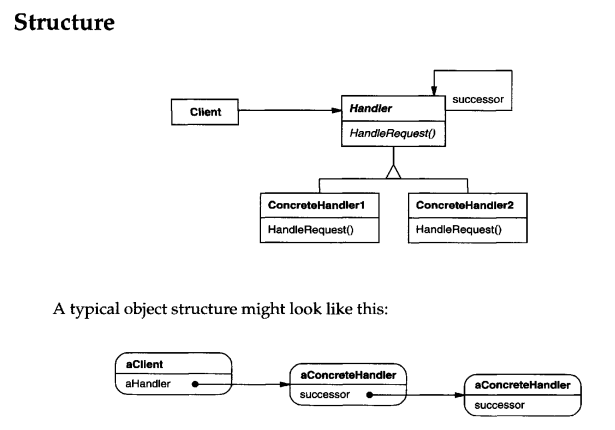

# CHAIN OF RESPONSIBILITY
## Intent
Avoid coupling the sender of a request to its receiver by giving more than one object a chance to handle the request. Chain the receiving objects and pass the request along the chain until an object handles it.
## Applicability
Use Chain of Responsibility when

• More than one object may handle a request, and the handler isn't known a priori. The handler should be ascertained automatically.

• You want to issue a request to one of several objects without specifying the receiver explicitly.

• The set of objects that can handle a request should be specified dynamically.

