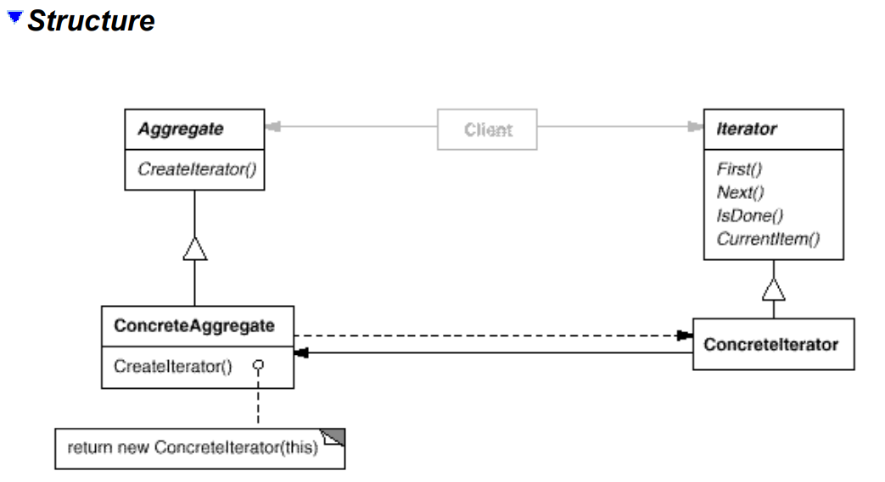

# Iterator
## Intent
Provide a way to access the elements of an aggregate object sequentially without exposing its underlying representation. 

## Applicability
Use the Iterator pattern
- to access an aggregate object's contents without exposing its internal representation.
- to support multiple traversals of aggregate objects.
- to provide a uniform interface for traversing different aggregate structures (that is, to support polymorphic iteration). 

## Structure

## Participants
• **Iterator**
- defines an interface for accessing and traversing elements.

• **Concretelterator**
- implements theIterator interface.
- keeps track ofthe current position in the traversal ofthe aggregate.

• **Aggregate**
- defines an interface for creating an Iterator object.

• **ConcreteAggregate**
- implements the Iterator creation interface to return an instance of the
proper Concretelterator.
## Collaborations
• A Concretelterator keeps track of the current object in the aggregate and can
compute the succeeding object in the traversal.