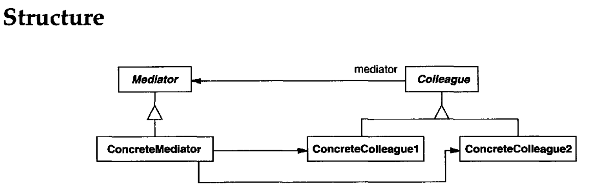

# MEDIATOR
## Intent
Define an object that encapsulate show a set of objects interact. Mediator promotes loose coupling by keeping objects from referring to each other explicitly, and it lets you vary their interaction independently.
## Applicability
Use the Mediator pattern when
- a set of objects communicate in well-defined but complex ways.The resulting interdependencies are unstructured and difficult to understand.
- reusing an object is difficult because it refers to and communicates with many other objects.
- a behavior that's distributed between several classes should be customizable without a lot of subclassing.
## Structure

A typical object structure might look like this:

## Participants
• **Mediator** (DialogDirector)
- defines an interface for communicating with Colleague objects.

• **ConcreteMediator** (FontDialogDirector)
- implements cooperative behavior by coordinating Colleague objects.
- knows and maintains its colleagues.

• **Colleague classes** (ListBox, EntryField)
- each Colleague class knows its Mediator object.
- each colleague communicates with its mediator whenever it would have otherwise communicated with another colleague.
## Collaborations
• Colleagues send and receive requests from a Mediator object. The mediator implements the cooperative behavior by routing requests between the appropriate colleague(s).