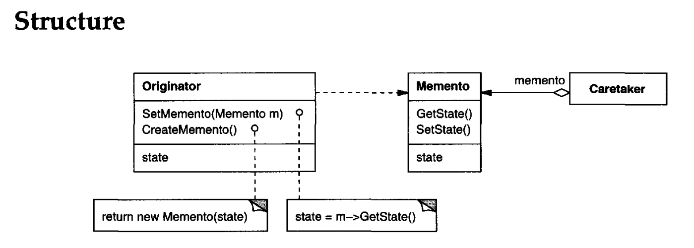
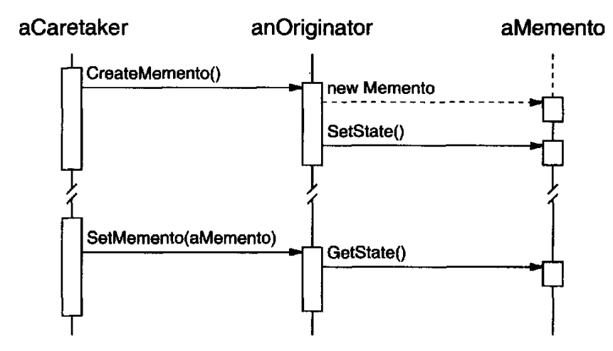

# MEMENTO
## Intent
Without violating encapsulation, capture and externalize an object's internal state so that the object can be restored to this state later.
## Applicability
Use the Memento pattern when
- a snapshot of (some portion of) an object's state must be saved so that it can be restored to that state later, and
- a direct interface to obtaining the state would expose implementation details and break the object's encapsulation.
## Structure

## Participants
• **Memento** (SolverState)
- stores internal state of the Originator object. The memento may store as much or as little of the originator's internal state as necessary at its originator's discretion.
- protects against access by objects other than the originator. Mementos have effectively two interfaces. Caretaker sees a narrow interface to the Memento—it can only pass the memento to other objects. Originator, in contrast, sees a wide interface, one that letsit access all the data necessary to restore itself to its previous state. Ideally, only the originator that produced the memento would be permitted to access the memento's internal state.

• **Originator** (ConstraintSolver)
- creates a memento containing a snapshot of its current internal state.
- uses the memento to restore its internal state.

• **Caretaker** (undo mechanism)
- is responsible for the memento's safekeeping.
- never operates on or examines the contents of a memento.

## Collaborations
- A caretaker requests a memento from an originator, holds it for a time, and passes it back to the originator, as the following interaction diagram illustrates:

Sometimes the caretaker won't pass the memento back to the originator, because the originator might never need to revert to an earlier state.
- Mementos are passive. Only the originator that created a mementowill assign or retrieve its state