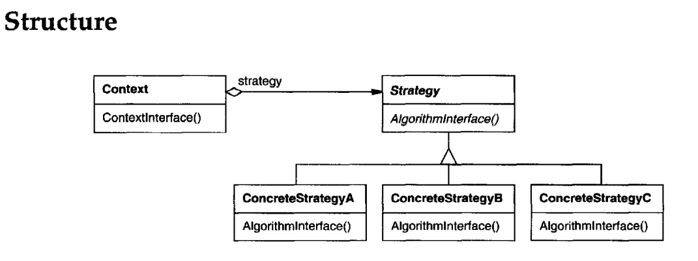

# STRATEGY
## Intent
Define a family of algorithms, encapsulate each one, and make them interchangeable. Strategy lets the algorithm vary independently from clients that use it.
## Applicability
Use the Strategy pattern when
- many related classes differ only in their behavior. Strategies provide a way to configure a class with one of many behaviors.
- you need different variants of an algorithm. For example, you might define algorithms reflecting different space/time trade-offs. Strategies can be used when these variants are implemented as a class hierarchy of algorithms [HO87].
- an algorithm uses data that clients shouldn't know about. Use the Strategy pattern to avoid exposing complex, algorithm-specific data structures.
- a class defines many behaviors, and these appear as multiple conditional statements in its operations. Instead of many conditionals, move related conditional branches into their own Strategy class.
## Structure

## Participants
• **Strategy** (Compositor)
- declares an interface common to all supported algorithms. Context uses this interface to call the algorithm defined by a ConcreteStrategy.

• **ConcreteStrategy** (SimpleCompositor, TeXCompositor, ArrayCompositor)
- implements the algorithm using the Strategy interface.

• **Context** (Composition)
- is configured with a ConcreteStrategy object.
- maintains a reference to a Strategy object.
- may define an interface that lets Strategy access its data.
## Collaborations
- Strategy and Context interact to implement the chosen algorithm. A context may pass all data required by the algorithm to the strategy when the algorithm is called. Alternatively, the context can pass itself as an argument to Strategy operations. That lets the strategy call back on the context as required.
- A context forwards requests from its clients to its strategy. Clients usually create and pass a ConcreteStrategy object to the context; thereafter, clients interact with the contextexclusively.There is often a family ofConcreteStrategy classes for a client to choose from.
