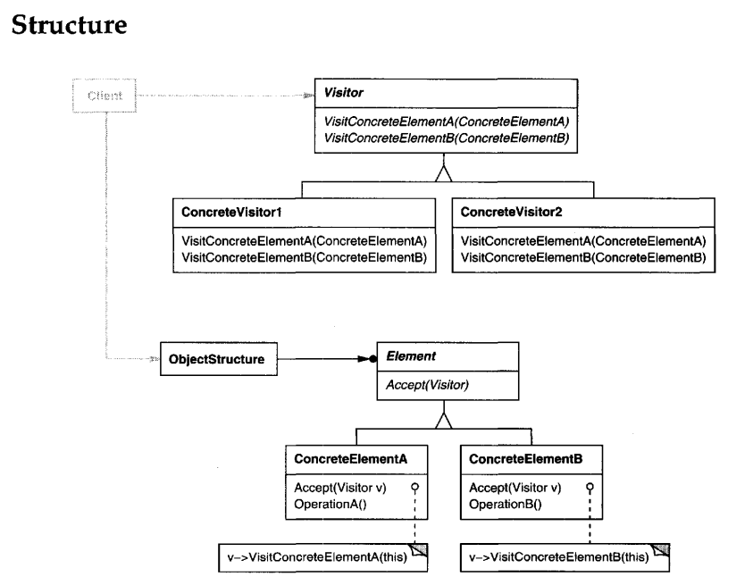
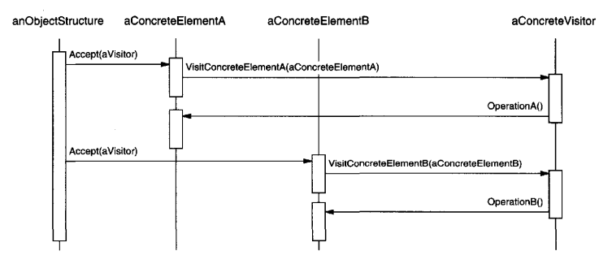

# VISITOR
## Intent
Represent an operation to be performed on the elements of an object structure.Visitor lets you define a new operation without changing the classes of the elements on which it operates.
## Applicability
Use the Visitor pattern when
- an object structure contains many classes of objects with differing interfaces, and you want to perform operations on these objects that depend on their concrete classes.
- many distinct and unrelated operations need tobe performed on objects in an object structure, and you want to avoid "polluting" their classes with these operations. Visitor lets you keep related operations together by defining them in one class. When the object structure is shared by many applications, use Visitor to put operations in just those applications that need them.
- the classes defining the object structure rarely change, but you often want to define new operations over the structure. Changing the object structure classes requires redefining the interface to all visitors, which is potentially costly. If the object structure classes change often, then it's probably better to define the operations in those classes.
## Structure

## Participants
• **Visitor** (NodeVisitor)
- declares a Visit operation for each class of ConcreteElement in the object structure. The operation's name and signature identifies the class that sends the Visit request to the visitor. That lets the visitor determine the concrete class of the element being visited. Then the visitor can access the element directly through its particularinterface.

• **ConcreteVisitor** (TypeCheckingVisitor)
- implements each operation declared by Visitor. Each operation implements a fragment of the algorithm defined for the corresponding class of object in the structure. ConcreteVisitor provides the context for the algorithm
and stores its local state. This state often accumulates results during the traversal of the structure.

• **Element** (Node)
- defines an Accept operation that takes a visitor as an argument.

• **ConcreteElement** (AssignmentNode,VariableRefNode)
- implements an Accept operation that takes a visitor as an argument.

• **ObjectStructure** (Program)
- can enumerate itselements.
- mayprovide a high-level interface to allow the visitor to visit its elements.
- may either be a composite (see Composite (163)) or a collection such as a list or a set.
## Collaborations
- A client that uses the Visitor pattern must create a ConcreteVisitor object and then traverse the object structure, visiting each element with the visitor.
- When an element is visited, it calls the Visitor operation that corresponds to its class. The element supplies itself as an argument to this operation to let the visitor access its state, if necessary.
The following interaction diagram illustrates the collaborations between an object structure, a visitor, and two elements:
