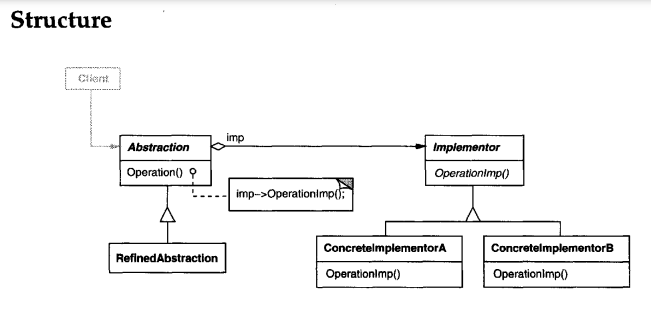

# BRIDGE
## Intent
Decouple an abstraction from its implementation so that the two can vary independently.
## Applicability
Use the Bridge pattern when

• you want to avoid a permanent binding between an abstraction and itsimplementation. This might be the case,for example,when the implementation
must be selected or switched at run-time.

• both the abstractions and their implementations should be extensible by
subclassing. In this case, the Bridge pattern lets you combine the different
abstractions and implementations and extend them independently.

• changes in the implementation of an abstraction should have no impact on
clients; that is, their code should not have to be recompiled.

• (C++) youwant tohide theimplementation ofanabstraction completely from
clients. In C++ the representation of a class is visible in the class interface.

• you have a proliferation of classes as shown earlier in the first Motivation
diagram. Such a class hierarchy indicates the need forsplitting an object into
two parts. Rumbaugh uses the term "nested generalizations" [RBP+91] to
refer to such classhierarchies.

• youwant toshare animplementationamongmultiple objects(perhaps using
reference counting), and this fact should be hidden from the client.A simple
example isCoplien's String class [Cop92], in which multiple objects can share
the same string representation (StringRep).

