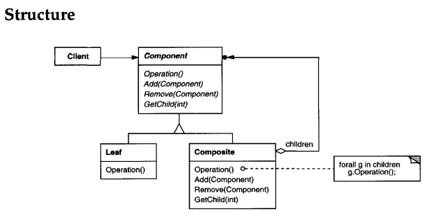

# COMPOSITE
## Intent
Compose objects into tree structures to represent part-whole hierarchies. Composite lets clients treat individual objects and compositions of objects uniformly.

## Applicability
Use the Composite pattern when

• you want to represent part-whole hierarchies ofobjects.

• you want clients to be able to ignore the difference between compositions of
objects and individual objects. Clients will treat all objectsin the composite
structure uniformly.

