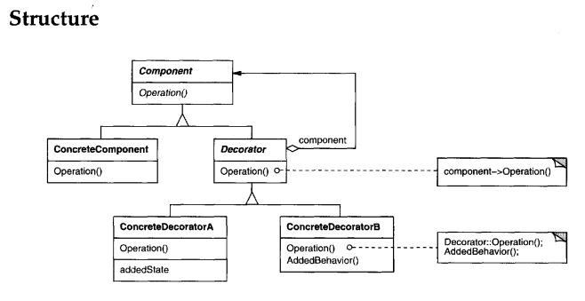

# DECORATOR
## Intent
Attach additional responsibilities to an object dynamically. Decorators provide a flexible alternative to subclassing for extending functionality.
## Applicability
Use Decorator
• to add responsibilities to individual objects dynamically and transparently,
that is, without affecting other objects.
• forresponsibilities that canbe withdrawn.
• when extension by subclassing is impractical. Sometimes a large number
of independent extensions are possible and would produce an explosion of
subclasses to support every combination. Or a class definition maybe hidden
or otherwise unavailable for subclassing.

