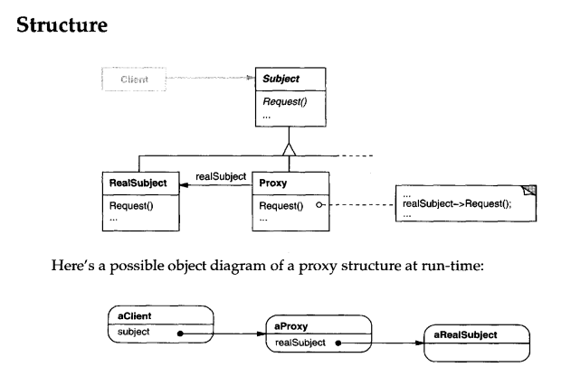

# PROXY PATTERN
# Intent
Provide a surrogate or placeholder for another object to control access to it.

# Applicability
Proxy is applicable whenever there is a need for a more versatile or sophisticated
reference to an object than a simple pointer. Here are several common situations
in which the Proxy pattern is applicable:

1. A remote proxy provides a local representative for an object in a different
address space. NEXTSTEP [Add94] uses the class NXProxy for this purpose.
Coplien [Cop92] calls this kind of proxy an "Ambassador."

2. A virtual proxy creates expensive objects on demand. The ImageProxy described in the Motivation is an example of such aproxy.

3. A protection proxy controls access to the original object. Protection proxies
are useful when objects should have different access rights. For example,
KernelProxies in the Choices operating system [CIRM93] provide protected
access to operating system objects.

4. A smart reference is a replacement for a bare pointerthat performs additional
actions when an object is accessed. Typical uses include

    • counting the number of references to the real object so that it can be
    freed automatically when there are no more references (also called smart
    pointers [Ede92]).

    • loading a persistent object into memory when it's first referenced.

    • checking that the real object is locked before it's accessed to ensure that no other object can change it.

